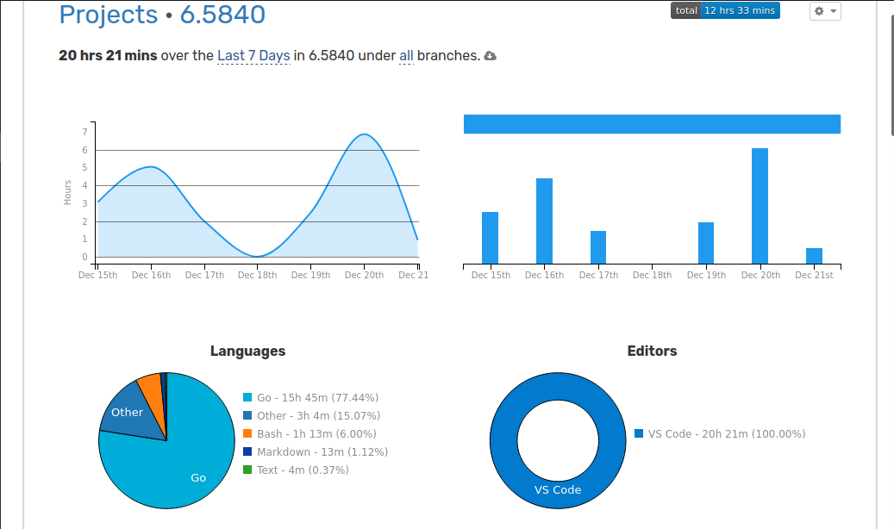
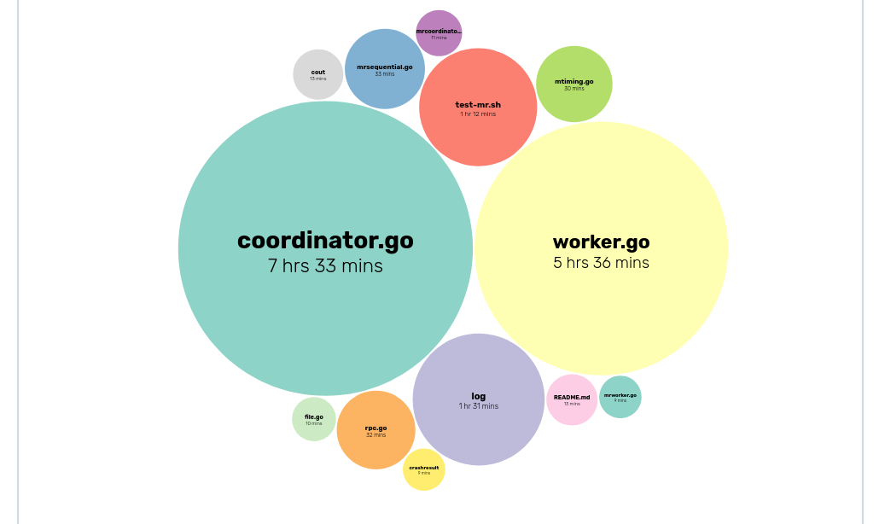

## Welcome Here
This is *TuNNan's* repository for **MIT 6.5840**
### Lab1: MapReduce

Two Programs: the *coordinator* and the *worker*.
Just **one** coordinator process, **one or more** worker processes executing in parallel. All processes run on one machine.

Worker talk to coordinator via *RPC*.

- Each worker process ask the coordinator for a *task*
- read the taks's input from one or more files
- execute the task
- write the task's output to one or more files.

The coordinator should **notice** if a worker hasn't completed its task in a reasonable amount of time, give the same task to a different worker.
#### MARK: 2023/12/21: LAB1 all passed 
Time Used:

